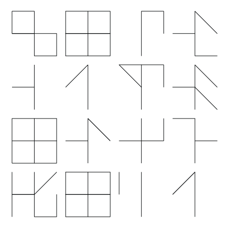

# Cistergraphia

Cipher your message with some techniques to a number sequence
and then use the cistercian numbers and a nice snail placement.

To use this cipher, you just have to run `./cipher` ruby script.

```
# chussenot in ~/Sites/misc/cistergraphia on git:master ✔, ruby:2.4.1, node:v8.3.0, tf:0.11.2, tg:0.13.7, aws:default
$ ./cister
What is your message? La navire est proche du point de rendez-vous
La navire est proche du point de rendez-vous

# chussenot in ~/Sites/misc/cistergraphia on git:master ✔, ruby:2.4.1, node:v8.3.0, tf:0.11.2, tg:0.13.7, aws:default
$ cat tmp/inline.svg
<?xml version="1.0" standalone="no"?>
<!DOCTYPE svg PUBLIC "-//W3C//DTD SVG 1.1//EN" "http://www.w3.org/Graphics/SVG/1.1/DTD/svg11.dtd">
<svg width="10000" height="100" version="1.1" xmlns="http://www.w3.org/2000/svg" xmlns:xlink="http://www.w3.org/1999/xlink">
<line x1="50" y1="0" x2="50" y2="100" style="stro
....

```



## Installation

Add this line to your application's Gemfile:

```ruby
gem 'cistergraphia'
```

And then execute:

    $ bundle

Or install it yourself as:

    $ gem install cistergraphia

## Usage

TODO: Write usage instructions here

## Development

After checking out the repo, run `bin/setup` to install dependencies. Then, run `rake spec` to run the tests. You can also run `bin/console` for an interactive prompt that will allow you to experiment.

To install this gem onto your local machine, run `bundle exec rake install`. To release a new version, update the version number in `version.rb`, and then run `bundle exec rake release`, which will create a git tag for the version, push git commits and tags, and push the `.gem` file to [rubygems.org](https://rubygems.org).

## Contributing

Bug reports and pull requests are welcome on GitHub at https://github.com/[USERNAME]/cistergraphia. This project is intended to be a safe, welcoming space for collaboration, and contributors are expected to adhere to the [Contributor Covenant](http://contributor-covenant.org) code of conduct.

## License

The gem is available as open source under the terms of the [MIT License](https://opensource.org/licenses/MIT).

## Code of Conduct

Everyone interacting in the Cistergraphia project’s codebases, issue trackers, chat rooms and mailing lists is expected to follow the [code of conduct](https://github.com/[USERNAME]/cistergraphia/blob/master/CODE_OF_CONDUCT.md).

## References

- [cistercian numbers](https://glossographia.wordpress.com/2013/07/09/cistercian-number-magic-of-the-boy-scouts/)
- [the ciphers of the monks](https://en.wikipedia.org/wiki/The_Ciphers_of_the_Monks)
- [King Ciphers](http://akira.ruc.dk/~jensh/Publications/2002%7bR%7d21_King_Ciphers.PDF)
- [cistercian-numerals-ciphers-of-monks](http://luxoccultapress.blogspot.fr/2013/01/cistercian-numerals-ciphers-of-monks.html)
- [create a stacked cipher](https://www.wikihow.com/Create-a-Stacked-Cipher)
